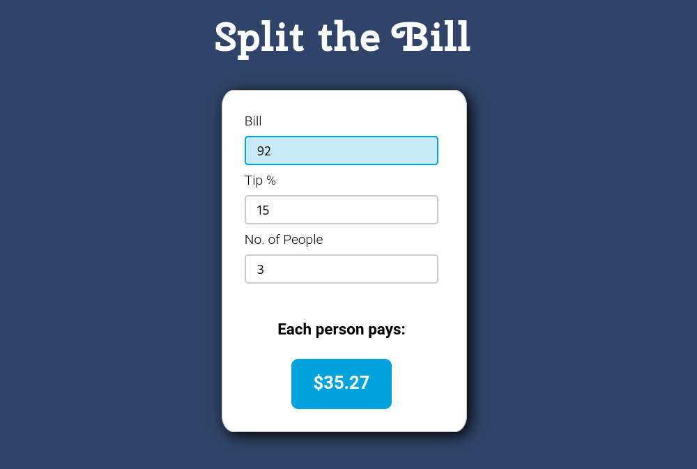

# Split the Bill - Tip Calculator

*Split the Bill* is a simple tip calculator application I made to learn **React JS**. I kept the feature list short, to keep the application clean and easy to use.



### Live Demo

[Try the app now!]()

## Lessons Learned

### States
* use state/set state

```
  const [bill, setBill] = useState(0);
  const [tip, setTip] = useState(0);
  const [people, setPeople] = useState(1);
```

### onChange Events

* `evt.target.value` captures what the user types in an input
* To capture an input's value on change:

```
onChange={(evt) => setPeople(parseInt(evt.target.value))}
```

### isNaN()
To prevent the total amount box from displaying NaN, I learned about the isNaN() method.

```
if (isNaN(bill)) {
    mathTotal = 0;
  } else {
    mathTotal = (bill + totalTip) / people;
  }
```

### .toFixed

To prevent the total amount box from displaying a long number, I learned about the toFixed() method.

```
${mathTotal.toFixed(2)}
```


### parseInt()
* Sets to a value, not a string

```
onChange={(evt) => setTip(parseInt(evt.target.value))}
```

### Fix Chrome Input CSS

I just discovered that ***outline: none;*** removes the default chrome based `:focus` behaviour and uses the desired css like a fallback.

```
input {
  outline: none;
}

input:active {
  border: 1px solid #00a2dd;
}

input:focus {
  border: 1px solid #00a2dd;
}
```


