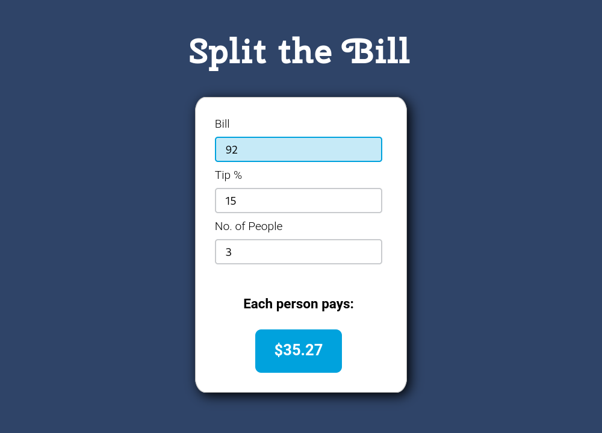

# Split the Bill - Tip Calculator

*Split the Bill* is a simple tip calculator application I made to learn **React JS**. I kept the feature list short, to keep the application clean and easy to use.



### Live Demo

[Try the app now!]()

## Lessons Learned

### React JS Hooks

I was able to declare, read, and update states with the useState() hook.

```
  const [bill, setBill] = useState(0);
```

### onChange Events

I captured the user's input with `evt.target.value`, then set a state to that value.

```
onChange={(evt) => setPeople(parseInt(evt.target.value))}
```

### isNaN()
To prevent the total amount box from displaying NaN, I learned about the isNaN() method.

```
if (isNaN(bill)) {
    mathTotal = 0;
  } else {
    mathTotal = (bill + totalTip) / people;
  }
```

### .toFixed

To prevent the total amount box from displaying a long number, I learned about the toFixed() method.

```
${mathTotal.toFixed(2)}
```


### parseInt()

I learned to change a string into a numeric value type with parseInt().

```
onChange={(evt) => setTip(parseInt(evt.target.value))}
```

### Cross Browser Compatibility

To make my input styles the same across browsers, I learned that `outline: none` removes the default chrome based `:focus` behaviour.

```
input {
  outline: none;
}
```


